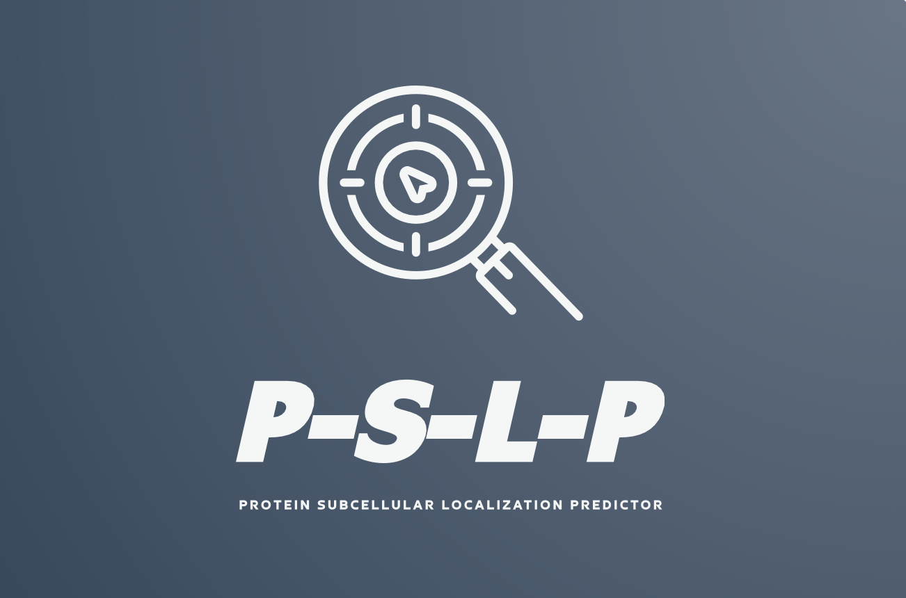

# Protein Subcellular Localization Predictor
<p align="center">   
</p>

<p align="center">
  A deep learning model to predict protein subcellular localization from amino acid sequences.
  <br />
  <a href="https://github.com/Andrej-Hric/cellular-compartment-predictor"><strong>Explore the repository »</strong></a>
  <br />
  <br />
  <a href="<URL_TO_ISSUES_PAGE>">Report a Bug</a>
</p>

## Table of Contents

- [About the Project](#about-the-project)
  - [Adapting the code for other Database](#Adapting-the-code-for-other-database)
- [Getting Started](#getting-started)
  - [Prerequisites](#prerequisites)
  - [Installation](#installation)
- [Usage](#usage)
  - [Running the Function](#running-the-function)
  - [Compatibility and Tensorflow Versions](#compatibility-and-tensorflow-versions)
  - [Troubleshooting](#troubleshooting)
- [Input File Formats](#input-file-formats)
- [Customizing the Model](#customizing-the-model)
- [Contributing](#contributing)
- [License](#license)


## About the Project
This Python script uses a deep learning model (LSTM) to predict protein subcellular localization based on their amino acid sequences. The input data can be in CSV, FASTA, GFF, or simple text format. The script currently uses the UniProt database, **however, it can be adapted for other databases if required** ([Adapting the code for other Database](#adapting-the-code-for-another-database)).

### Adapting the Code for Another Database

If you would like to use a different protein sequence database instead of UniProt, follow these steps to adapt the code:

1. Replace the `get_uniprot_data` function with a new function to retrieve data from your preferred database. Update the function name and the URL for the API request. You may also need to modify the request parameters and the way the response is processed, depending on the API documentation of the new database.

2. If the new database uses a different file format for protein sequences, update the `read_input_file` function to handle the new format. You may need to add a new condition in the function to check for the file extension and process the file accordingly.

3. Update the `preprocess_data` function if the new database has different data formatting or additional attributes that need to be processed before training the model.

4. Verify that the remaining code works correctly with the new database. You may need to adjust the model architecture, hyperparameters, or training process based on the characteristics of the new data.

### ⚠️Potential Issues When Adapting the Code for Another Database ⚠️
While adapting the code for another protein sequence database, you may come across some issues or errors. Here are some common challenges you might face and need to address during the adaptation process:

  1. **API limitations**: Some databases may have limitations on the number of requests, rate limits, or require authentication. You may need to adjust the code accordingly to handle these limitations, which may include using API keys, implementing request throttling, or handling pagination.

  2. **API response format**: Different databases may return data in various formats, such as JSON or XML. You will need to adapt the code to parse the new response format correctly and extract the relevant information.

  3. **Data preprocessing**: Depending on the new database, the data preprocessing steps might need to be adjusted to handle different data formats, attributes, or normalization methods.

  4. **Model performance**: The performance of the LSTM model might be different when trained on data from a new database. You might need to experiment with different model architectures, hyperparameters, or training techniques to achieve optimal performance on the new dataset.

  5. **Code compatibility**: There might be compatibility issues with the new database or the required libraries for handling the data, which may require updates or adjustments to the existing code.


## Getting Started

To get started with the Protein Subcellular Localization Predictor, follow these steps.

### Prerequisites

You'll need to have the following software installed on your computer:

- **Python 3.8 ! (required to be compatible with tensorflow)**: Download and install the appropriate version for your operating system from [python.org](https://www.python.org/downloads/).
- **Git**: Download and install the appropriate version for your operating system from [git-scm.com](https://git-scm.com/downloads).
- **Basic knowledge of Python programming and command line interface** (CLI): New to python as a bioscientist like me ?  you can learn the basics from the [Python documentation](https://docs.python.org/3/tutorial/) or [Python for Beginners](https://www.python.org/about/gettingstarted/). If you are not familiar with the command line interface, you can learn the basics from [this tutorial](https://www.codecademy.com/learn/learn-the-command-line). 

### Setting up a Virtual Environment
- After you have installed python and GIT, you can set up a virtual environment for the project. This will allow you to install the required Python libraries without affecting other projects on your computer. To set up a virtual environment, follow these steps:

1. Open terminal (masOS/Linux) or command prompt (Windows).

- **For macOS with M1 Silicon [unfortunatelly like me :(  ] you need to use Rosetta 2 to run the virtual environment**
   ```sh
   softwareupdate --install-rosetta
   ```
   **You might need to enter admin password to install Rosetta 2**
     
   -with Rosseta installed, close the terminal and open a new one. **Right click (control click) on terminal app and select "Get Info"**. In the "Get Info" window, check the box next to "Open using Rosetta" and close the window. Close the Get info window. 
   From this point if you open terminal it will run using Rosseta allowing you to use Intel-based software and commands needed (Should have tought about it before buying the new macbooks :D )

2. Create a new virtual environment:
   ```sh
   python3.8 -m venv cell_comp_project_env

3. Activate the virtual environment:
   - For Windows:
      ```sh
      cell_comp_project_env\Scripts\activate
   - For macOS/Linux:
      ```sh
      source cell_comp_project_env/bin/activate

### Installation
1.  Clone the Git repository:
     ```sh
     git clone https://github.com/Andrej-Hric/cellular-compartment-predictor.git

2. Change the current directory to the project folder:
   ```sh
   cd cellular-compartment-predictor # or your directory of choice

3. Upgrade pip (python package installer) note on higher python version ned to use pip3 however this is not the case for python 3.8 required for this project:
   ```sh
   python -m pip install --upgrade pip

4. Install required packages:
   ```sh
   pip install tensorflow numpy pandas scikit-learn biopython

**NOTE**
   If you are using macOS with M1 Silicon, you will need to install the following packages instead (the project is compativble with tensorflow 2.3.0 +):
      ```sh
      pip install tensorflow-macos numpy pandas scikit-learn biopython

## Usage
- In this project folder/repository there are three Py files: "main.py", "data_processing.py" and "model.py". The main.py file contains the main function that runs the program. The data_processing.py file contains functions for retrieving and preprocessing the data. The model.py file contains functions for building and training the model. The main.py file imports the functions from the other two files and uses them to run the program. The main.py file also contains the code for parsing command line arguments and saving the model to a file.

To use the Protein Subcellular Localization Predictor, follow these steps:

1. Save your protein sequences in a supported file format (CSV, FASTA, GFF, or TXT).
2. Open a terminal window and navigate to the folder containing the `main.py` file.
3. Run the following command:
    ```sh
    python main.py
4. The model will be trained and evaluated. The performance metrics will be displayed in the terminal.

### Running the Function
To run the function, use the following command:
      ```sh
      python main.py <input_file> <output_file> [--model_file <model_file>]
**Replace <input_file> with the path to your input file, <output_file> with the path to the output file, and <model_file> with the path to a saved model file (optional).**

### Compatibility and Tensorflow Versions
```TensorFlow package might have different compatibility requirements based on the system and hardware in use. Be sure to check the TensorFlow installation guide for detailed information: https://www.tensorflow.org/install.```

This project is compatible with the following operating systems and devices:

- Windows
- macOS
- macOS M1 Silicon (using Rosetta 2)
**It is important to note that TensorFlow has specific version requirements for macOS M1 Silicon. Make sure to install the appropriate version of TensorFlow for your system.**
 
## Troubleshooting
If you encounter issues or errors while running the script, consider the following troubleshooting steps:

1. Double-check that you have installed all required libraries and that they are compatible with your system.
2. Verify that your input file is in a supported format (CSV, FASTA, GFF, or TXT).
3. Ensure that you are using the correct command to run the function, including the proper input and output file paths.
4. Check the TensorFlow version installed on your system, and make sure it is compatible with your operating system and device (especially if you are using macOS M1 Silicon).
5. If you are using a virtual environment, ensure that it is activated before running the script.
6. Examine any error messages or logs to identify potential issues in the code, libraries, or dependencies.
7. If you have adapted the code for another database, ensure that you have made all necessary modifications, including updating the input file format handling, data preprocessing, and API requests.
8. Check the compatibility of the Python version you are using with the TensorFlow version installed. This project requires Python 3.8 to be compatible with TensorFlow.
9. If you continue to experience issues, consider seeking help from the community by opening an issue on the repository's issues page or consulting the TensorFlow documentation and community resources.
## Input File Formats

The script supports the following input file formats:

- **CSV** : Comma-separated values format, with a header row. The first column should contain protein IDs, and the second column should contain the amino acid sequences. 
      - example: 
      ```ID,Sequence  P12345,MAEGEITTFTALTEKFNLPPGNYKKPKLLYCSNGGHFLRILPDGTVDGTRDRSDQHIQLQLSAESVGEVYIKSTETGQYLAMDTSGLLYGSQTPSEECLFLERLEENHYNTYTSKKHAEKNWFVGLKKNGSCKRGPRTHYGQKAILFLPLPV ```

- **FASTA**:  FASTA format, with each sequence preceded by a header line starting with '>'. The header line should contain the protein ID, followed by a space or a pipe symbol.
      - example: 
      ```>P12345 | example protein sequence MAEGEITTFTALTEKFNLPPGNYKKPKLLYCSNGGHFLRILPDGTVDGTRDRSDQHIQLQLSAESVGEVYIKSTETGQYLAMDTSGLLYGSQTPSEECLFLERLEENHYNTYTSKKHAEKNWFVGLKKNGSCKRGPRTHYGQKAILFLPLPV ```
- **GFF**: General Feature Format, with each sequence in a separate entry. The sequence column should contain the amino acid sequences, and the attribute column should include the protein ID.
      - example: 
      ##gff-version 3
      ```chr1 . protein 1 100 . + . ID=P12345;Name=ProteinA```
      ##FASTA
      ```MAEGEITTFTALTEKFNLPPGNYKKPKLLYCSNGGHFLRILPDGTVDGTRDRSDQHIQLQLSAESVGEVYIKSTETGQYLAMDTSGLLYGSQTPSEECLFLERLEENHYNTYTSKKHAEKNWFVGLKKNGSCKRGPRTHYGQKAILFLPLPV```


- **TXT**: Simple text format, with one sequence per line. The protein IDs should be provided in a separate file, with each ID on a new line, in the same order as the sequences.
      - example: 
      ```MAEGEITTFTALTEKFNLPPGNYKKPKLLYCSNGGHFLRILPDGTVDGTRDRSDQHIQLQLSAESVGEVYIKSTETGQYLAMDTSGLLYGSQTPSEECLFLERLEENHYNTYTSKKHAEKNWFVGLKKNGSCKRGPRTHYGQKAILFLPLPV```
      ```P12345``` 

**!!!When using the script, make sure to provide the input file in one of the supported formats!!!**

**!!!The script will automatically detect the file format and process it accordingly. If you need to use a different file format, you may need to adapt the ``` read_input_file'function``` in the code to handle the new format!!!**

## Customizing the Model

You can customize the model by modifying the parameters in the `model.py` and `main.py` files, such as:

- `MAX_SEQUENCE_LENGTH`: The maximum length of protein sequences considered by the model.
- LSTM layer parameters: Number of units, dropout, and recurrent dropout.
- Dense layer parameters: Number of units and activation function.
- Training parameters: Batch size, number of epochs, and learning rate.

Refer to the code comments for more information on the available options and their effects on the model's performance.

## Contributing:

If you'd like to contribute to the project, please follow these steps:

1. Fork the repository.
2. Create a branch with a descriptive name.
3. Make changes to the code in your branch.
4. Commit your changes and push them to your fork.
5. Create a pull request and explain your changes.

## License:

This project is licensed under the MIT License. 

## Acknowledgements:

- UniProt: Source of protein sequence data.
- TensorFlow: Deep learning library used for model development.
- Biopython: Library for handling FASTA and GFF files.
- Looka: Logo maker used to create the project logo [src="Logo/PSLP-logo_FREE_online.png"]
